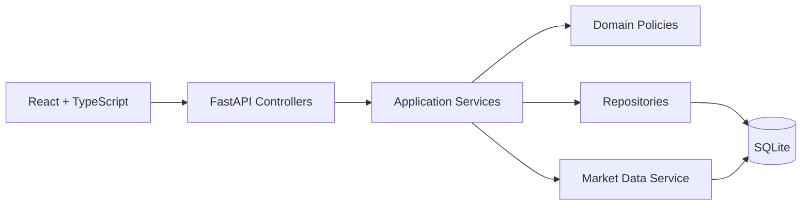

# MarketScope Architecture

## Runtime

## Layers

- **API**: HTTP contracts, controller authentication/authorization, error mapping.
- **Services**: transaction orchestration and workflow sequencing.
- **Domain**: financial math, order state machine, watchlist validators, portfolio rules.
- **Repositories**: SQLite persistence only.
- **Core**: configuration, security, logging, database connection.

## Data ownership

SQLite is the sole source of truth. `market_ticks`, `order_events`, and `audit_events` are append-only histories. Portfolio and order state are mutable only while their business rules allow it.

## Financial persistence

`FixedDecimal` stores `Decimal` values scaled by 10,000 as SQLite integers. This avoids binary floating-point persistence while preserving four-decimal business precision.

## Enforced layering

`pyproject.toml` holds import-linter contracts (`uv run lint-imports`): api → services → domain/repositories → models, domain free of framework imports, controllers never touch the ORM/session directly. `tests/architecture/` runs the tool, proves it can fail, audits every route for authentication/admin dependency, and checks migration immutability via `migrations/MANIFEST.sha256`.

## Trade ledger and idempotency

Execution writes an append-only `trades` row in the same unit of work as the cash/holding change. Order placement is idempotent by `(customer_id, idempotency_key)` with a request fingerprint. The market ticker is leader-elected with a file lock so extra workers do not multiply price moves; the auth rate limiter is in-process (single-process deployment).

## Concurrency, database-level immutability and browser hardening

- **Serialized units of work.** Every order mutation (place, cancel, reject, execute) and watchlist creation first takes the SQLite write lock (`acquire_write_lock`, a no-op write) and expires cached state, so "read -> validate -> mutate" cannot interleave with a competing writer. `tests/integration/test_review_fixes.py` races two executions of one order: exactly one wins and the other receives `InvalidOrderStateException`. Duplicate watchlist names and the ten-watchlist cap resolve to 409, never a 500.
- **Append-only at the database.** Migration `0003` installs SQLite triggers that reject UPDATE/DELETE on `trades`, `order_events`, `audit_events`, `market_ticks`, DELETE on `orders`, and UPDATE of an EXECUTED order. The ORM listeners remain as the first line of defence; raw SQL is the second test.
- **Reads do not write.** A missing portfolio on `GET /portfolio` is logged (`portfolio_missing`) and answered with an unsaved opening balance; portfolios are created at registration and seeding only.
- **Browser headers.** The API sets `X-Content-Type-Options`, `X-Frame-Options`, `Referrer-Policy`, `Cache-Control: no-store` and a restrictive CSP (not on `/docs`, which loads its UI from a CDN).
- **Known, accepted limit.** The bearer token still lives in `localStorage` (documented in `specs/app_spec.md`); moving to an HttpOnly cookie is a design change tracked as future work.
